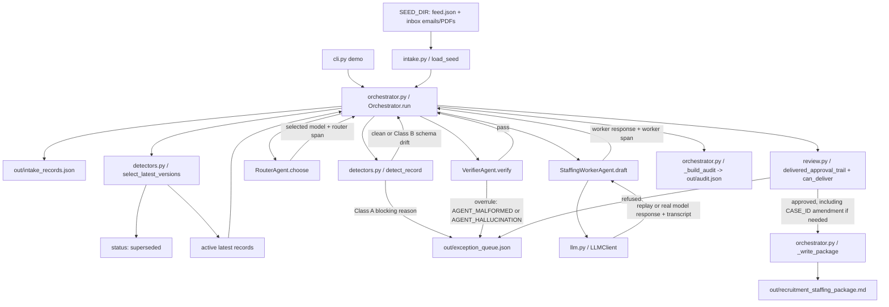

# Architecture

This document reflects the runtime implemented in the code. The system is controller-led: `Orchestrator.run()` owns the record loop, calls the agents, enforces budgets and approval, writes delivery artifacts, and builds the audit.

## Runtime Topology

## What Is An Agent

The audit roster in `cedx_fleet/contracts.py` defines four agents:

- `orchestrator`: the controlling agent. It can call `router`, `staffing_worker`, and `verifier`.
- `router`: a deterministic routing agent. It chooses the cheap or hard model and returns a trace span.
- `staffing_worker`: the drafting agent. It calls `LLMClient.complete_worker()` and writes a transcript.
- `verifier`: the independent checking agent. It can overrule malformed or unsupported Worker output.

These are not separate processes. They are separate role classes with typed inputs, outputs, and trace spans. The important grading property is that the Worker cannot deliver directly: the Orchestrator sends the Worker output to the Verifier, and the Verifier can block it before delivery.

## What Is A Helper

These modules are local pipeline helpers, not separate agents:

- `intake.py`: parses JSON, email, and PDF seed inputs into `SourceRecord` objects.
- `detectors.py`: applies deterministic exception rules and optional note classification.
- `review.py`: builds the approval trail and enforces the CASE_ID amendment.
- `audit.py`: tracks append-only-style run events used in `out/audit.json`.
- `llm.py`: wraps replay mode, real model calls, TOON prompt conversion, transcript writing, and optional note classification.

The optional note classifier is also a helper, not an audit-rostered agent. It only runs when `USE_LLM_NOTE_CLASSIFIER=true`, `REPLAY_LLM=false`, and `LLM_API_KEY` is present.

## Record Paths

### Delivered Record

1. `cli.py demo` creates `Orchestrator(seed_dir, out_dir, transcripts_dir)` and calls `run()`.
2. `load_seed()` parses all seed records and the Orchestrator writes `out/intake_records.json`.
3. `select_latest_versions()` splits latest active records from superseded versions.
4. `_process_active_record()` creates the first `orchestrator` trace span.
5. `detect_record()` returns no Class A blocker.
6. `RouterAgent.choose()` selects the model and returns a router span.
7. `StaffingWorkerAgent.draft()` calls `LLMClient.complete_worker()`.
8. `LLMClient` sends TOON-formatted input in real-online mode, or uses deterministic replay in offline mode, then writes a transcript.
9. `VerifierAgent.verify()` checks the Worker response against the original source record.
10. `delivered_approval_trail()` adds standard approval and, when the amount is at least the amendment threshold, the required `compliance` approval.
11. `can_deliver()` confirms the approval trail is valid.
12. The Orchestrator writes the branded Recruitment and Staffing package and includes the record in `out/audit.json`.

### Data Exception Record

If `detect_record()` returns a Class A reason such as `STALE`, `MISSING_INPUT`, `OUTLIER`, `INJECTION_BLOCKED`, `LOW_CONFIDENCE`, or `UNVERIFIED_ANOMALY`, the Orchestrator routes the record directly to exception. Router, Worker, and Verifier are not called for that record.

### Verifier Overrule Record

If the Worker output is missing required structure, the Verifier returns `AGENT_MALFORMED`. If the Worker changes source-supported fields such as owner, deadline, amount, category, case ID, or source version, the Verifier returns `AGENT_HALLUCINATION`. In both cases, the Orchestrator blocks delivery and writes the record to the exception queue.

### Superseded Record

Older versions of a record are marked `status: superseded` with reason `SUPERSEDED_VERSION`. They do not receive Router, Worker, or Verifier spans because they are not processed as active delivery candidates.

## Approval And CASE_ID Amendment

`compute_amendment()` derives the amendment for `CEDX-681ACE`: a second approver role of `compliance` is required when the amount is at least `40000`.

For delivered records, `review.py` creates this approval sequence:

1. `draft` by `staffing_worker`
2. `in_review` by `orchestrator`
3. `approved` by `operator`
4. `approved` by `compliance` when amount >= `40000`
5. `delivered` by `delivery`

The server-side delivery gate is `can_deliver()`. Delivery is refused if required approval is missing.

## Audit Reality

`out/audit.json` contains:

- `agents`: the registered four-agent roster.
- `records`: final status, reason code, delivered fields hash, transcript hash, approval trail, and ordered `agent_trace`.
- `cost`: total cost, average cost per record, p95 latency, and projection per 10k records.
- `events`: run and routing events appended by the Orchestrator.
- `output_package_hash`: hash of the branded package.

For delivered records, the normal `agent_trace` order is:

1. `orchestrator`
2. `router`
3. `staffing_worker`
4. `verifier`

For Class A data exceptions, the trace contains Orchestrator spans only. For superseded records, the trace is intentionally empty.

## LLM Modes

- Offline replay: `REPLAY_LLM=true`. The pipeline still runs end to end, writes transcripts, verifies Worker output, applies approval, and writes audit. No network key is required.
- Real-online mode: `REPLAY_LLM=false`. `LLMClient` uses `LLM_API_KEY` and model routing to call the configured provider.
- TOON prompt path: the Worker request is built as JSON locally, converted to TOON locally, and the TOON text is what gets sent to the model.
- Optional TOON response path: when `LLM_RESPONSE_FORMAT=toon`, the model can return TOON and the code converts it back to JSON locally before Verifier review.

